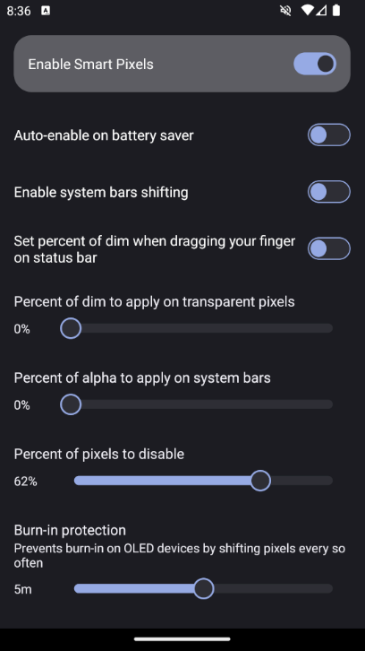

# SmartPiXelsPosed

A Xposed port of Smart Pixels feature.

Support and updates:
- [Channel](https://t.me/aerathfuns)
- [Support Group](https://t.me/buggychat)

## Screenshots

	

## Licensing

I kept all of original license headers and added my own classes then licensed them with GNU Affero General Public License v3.

## Roadmap

- [x] Main functionality
- [x] Detect configuration changes
- [x] Prepare a settings screen
- [x] Add enable/disable option
- [x] Add quick settings tile
- [x] Add auto-enable on battery saver
- [x] Merge translations
- [ ] EXTRA: Complete missing translations for new features
- [x] EXTRA: Add screen dimmer
- [x] EXTRA: Add system bars shifting (status bar only for now)
- [x] EXTRA: Add system bars opacity
- [x] EXTRA: Add stock ROM support (BETA)

## Credits

- [CrDroid ROM - Android Framework](https://github.com/crdroidandroid/android_frameworks_base)
- [CrDroid ROM - CrDroidSettings](https://github.com/crdroidandroid/android_packages_apps_crDroidSettings)
- [GravityBox R - ModStatusBar](https://github.com/GravityBox/GravityBox/blob/r/GravityBox/src/main/java/com/ceco/r/gravitybox/ModStatusBar.java)
- idyll (idyll5988) - Chinese translations for extra features
- Алексей (Osean22) - Russian translations for extra features
- Waze (XelXen) - App icon
